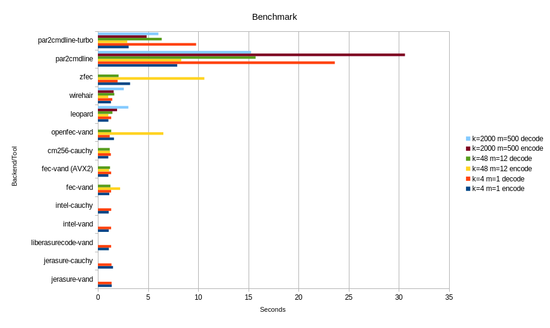

# Preliminary
We are going to be comparing this tool against 3 others

* [zfec](https://github.com/tahoe-lafs/zfec)
* [par2cmdline](https://github.com/Parchive/par2cmdline)
* [par2cmdline-turbo](https://github.com/animetosho/par2cmdline-turbo)

Each of these are in their own right useful tools for creating erasure coded backups, so I'll briefly describe what they do and their benefits/drawbacks.

* zfec is a very simple python/C application that splits the input into 'blocks', primary being the original and secondary being the parity, and is able to reconstruct the original input with only a subset of the output blocks. It does not have any integrity checking and as such any corruption within any of the primary blocks (or secondary if primary is missing) will lead to a corrupted output. Thus, users are expected to keep hashes in addition to the set of block files.
* par2cmdline is the older and more well known tool for making erasure coded backups. Designed to cope with the unreliability of Usenet, it computes a Reed Solomon Matrix from the input file[s] and stores the output recovery blocks in special par2 files. Thus, it doesn't modify the original data and allows you to corrupt any location in the original data as long as you have the requisitie number of recovery blocks to come back from your error. It's very slow and not performance oriented, and also uses OpenMP to be multithreaded.
* par2cmdline-turbo is a performance-oriented fork of par2cmdline, using modern CPU extensions and implements real multithreading support (rather than OpenMP). It is significantly faster than mainline par2cmdline.

# Benchmark
General details of the benchmark will be that the test file will be 1GiB of random data, the location will be in /tmp/ to minimize any bias from the storage device or filesystem, and that each tool shall get around 25% redundancy. The specific series of commands to do the test are listed below. The specific hardware details of the machine running the tests are that it is a HP Z440 Workstation, with 64GiB of RAM and a 28-core e5-2690 v4 Xeon CPU. These are run out of a Arch container, and each command is passed to hyperfine which gives us our results. Each suite is tested for (k=4, m=1), (k=48, m=12), and (k=2000, m=500). We also test our various parity backends as well, everything above zfec is a backend of bef.

bef version: 0.2.3 
zfec version: 1.5.7.4  
par2cmdline version: 0.8.1  
par2cmdline-turbo version: 1.1.1

Details below in code block so as to not mess up formatting

```
bef encode: bef -P $parity -b $((4*$k))K  -k $k -m $m -c -i test -o test.bef
bef corruption: for((i = 1; i < 1024; i++)); do dd if=/dev/urandom of=test.bef bs=4K count=1 conv=notrunc oseek=$(($i*250)) ; done
bef decode: bef -d -i test.bef -o test2

zfec encode: zfec -f -m $(($k+$m)) -k $k test  
zfec corruption: rm test.0_5.fec  
zfec decode: zunfec -f *.fec -o test2  

par2cmdline[-turbo] encode: par2 c -b$k -n1 -u -r25 test && rm *.par2
par2cmdline[-turbo] corruption: par2 c -b$k -n1 -u -r25 test && dd if=/dev/urandom of=test bs=4M count=1 conv=notrunc  
par2cmdline[-turbo] decode: par2 r test && mv test.1 test
```

A graph for the graphically minded (that big table can cause dyslexia)



|backend/tool|k=4 m=1 encode|k=4 m=1 decode|k=48 m=12 encode|k=48 m=12 decode|k=2000 m=500 encode|k=2000 m=500 decode|
|-|-|-|-|-|-|-|
|jerasure-vand|1.379 +- 0.049|1.362 +- 0.031|N/A|N/A|N/A|N/A|
|jerasure-cauchy|1.504 +- 0.013|1.353 +- 0.019|N/A|N/A|N/A|N/A|
|liberasurecode-vand|1.090 +- 0.030|1.319 +- 0.027|N/A|N/A|N/A|N/A|
|intel-vand|1.082 +- 0.014|1.317 +- 0.024|N/A|N/A|N/A|N/A|
|intel-cauchy|1.077 +- 0.019|1.326 +- 0.029|N/A|N/A|N/A|N/A|
|fec-vand|1.132 +- 0.017|1.315 +- 0.028|2.213 +- 0.039|1.244 +- 0.032|N/A|N/A|
|fec-vand (AVX2)|1.042 +- 0.027|1.321 +- 0.046|1.114 +- 0.017|1.207 +- 0.039|N/A|N/A|
|cm256-cauchy|1.035 +- 0.022|1.292 +- 0.013|1.200 +- 0.024|1.177 +- 0.034|N/A|N/A|
|openfec-vand|1.599 +- 0.047|1.176 +- 0.026|6.525 +- 0.028|1.326 +- 0.031|N/A|N/A|
|leopard|1.046 +- 0.027|1.325 +- 0.038|1.039 +- 0.029|1.449 +- 0.038|1.909 +- 0.061|3.035 +- 0.081|
|wirehair|1.296 +- 0.017|1.432 +- 0.027|1.029 +- 0.026|1.633 +- 0.031|1.570 +- 0.056|2.581 +- 0.051|
|zfec|3.207 +- 0.059|1.962 +- 0.034|10.614 +- 0.040|2.061 +- 0.030|N/A|N/A|
|par2cmdline|7.908 +- 0.019|23.624 +- 0.067|8.307 +- 0.128|15.724 +- 0.117|30.620 +- 0.981|15.275 +- 0.200|
|par2cmdline-turbo|3.067 +- 0.031|9.792 +- 0.042|2.920 +- 0.030|6.364 +- 0.017|4.859 +- 0.029|6.029 +- 0.033|

As one can see, my tool, for almost every backend available, is significantly faster than the other options. Specifically, fec-vand with AVX2 optimizations, cm256-cauchy, leopard, and wirehair are the fastest available, with leopard and wirehair both being significantly faster than par2cmdline\[-turbo\] (although the difference between turbo and them is not as significant). Zfec, although using the same code as fec-vand without AVX2 optimizations, is significantly slower than my tool on equivalent benchmarks, likely due to it being based on Python, it being single-threaded (although it's still significantly slower than bef with -T1), or it writing each block to its own file.

Another thing to note is that on prior benchmarks par2 performed much worse, as they were conducted on a rather poor laptop. It is likely that since par2cmdline\[turbo\] uses as much CPU as possible and is rather intensive on the machine, the laptop throttled itself due to overheating and memory bandwidth issues due to too much load.

# Error Resiliency
This comparison will be between bef and par2cmdline-turbo. The test file will have 1GiB random data. 

We will test the survival of the file following two separate corruption patterns, burst corruption (contiguous corruption of n bytes) and systematic corruption (corruption of one byte at every n offset). For par2, we will corrupt the original file, for bef we will corrupt the bef file. The table further below indicates at what value does the file become unrecoverable.

Specifically, the commands used are as follows

```
#par2 command, with maximum number of blocks, version v1.1.1
par2 c -r25 -b32768 -n1 -u $file

#bef command, likewise with max number of fragments (for zfec backend), version v0.3.0
bef -c -k 204 -m 51 -b 816K -i $file -o ${file}.bef

#burst corruption command
dd if=/dev/urandom of=$file bs=1K count=$n conv=notrunc oseek=1

#systematic corruption command (actually a C script)
./error < $file > ${file}2 && mv ${file2} $file
#where error.c is this file, modeled after my error resiliency test

#include <stdio.h>
#define N   $N

int main() {
    int i = 0;
    char in[1024];

    while(fread(in, 1024, 1, stdin) != 0) {
        if(i % N == 0)
            in[78] = '\0';
        fwrite(in, 1024, 1, stdout);
        i++;
    }
}

```

And here is our table
|tool|burst corruption limit|systematic corruption limit|
|-|-|-|
|bef|1041KiB|1/23KiB|
|par2|262112KiB|1/128KiB|

As one can see, my tool is significantly less resilient against burst corruption, at least not without a lot more memory, but is significantly more resilient against systematic corruption.
# Conclusions
My conclusions from these benchmarks is that if you want a fast and capable erasure coding tool and are fine with the inherent limitations in the format, pick my tool. Otherwise, if you want maximal protection at the cost of speed/streamability, pick par2cmdline-turbo. Stay away from both par2cmdline and zfec, the first is terribly slow and the second doesn't check for integrity while also being rather inflexible.
